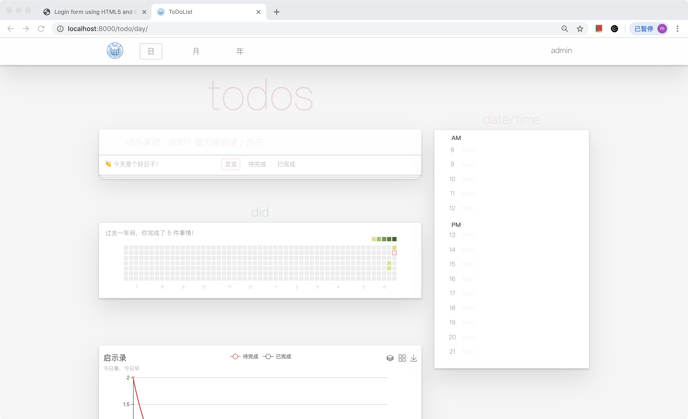
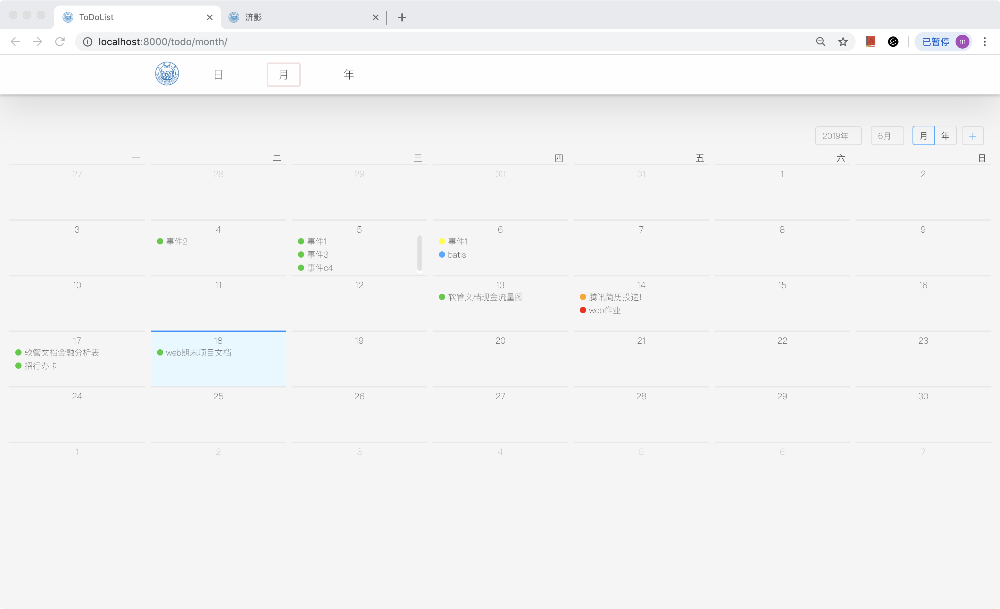
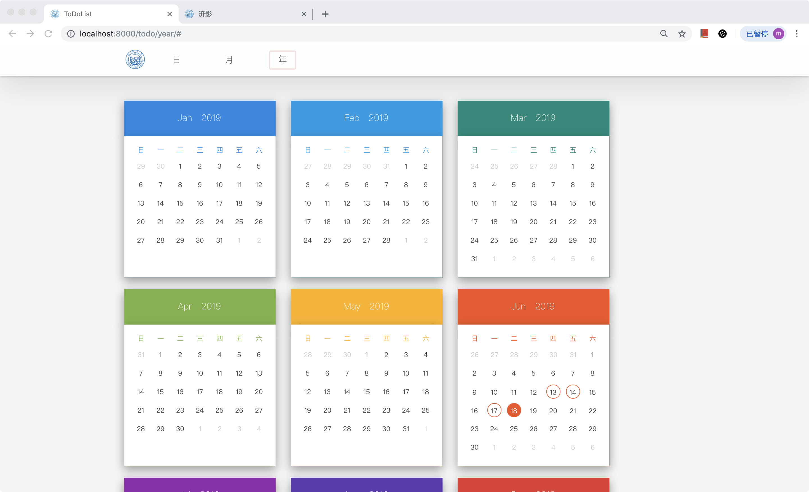

# ToDoList

## 1. 移动端

### 1.1 基本功能

1. ToDo新增
2. ToDo删除
3. 展现列表
4. 全部完成/取消（Toggle All）
5. 删除已完成
6. 保存页面状态

### 1.2 高级功能

1. ==过滤ToDo==， 支持过滤器为：全部、已完成、待完成
2. ==编辑单条ToDo==， 通过长按ToDo所在元素触发
3. ==有新意的交互行为：左滑删除ToDo==
4. ==本年的事件统计==，展示信息为：日期+当天完成的事件数
5. ==本周的事件统计==，分为ToDo，Did两类
6. ==支持事件优先级==，新增事件时在后面加叹号，叹号的数量表示优先级
7. ==本月的事件统计==，有事件的日期会画上圈圈，点击会显示当天事件
8. ==事件当日邮件提醒==

### 1.3 使用到的开源代码

1. cal-heatmap，一款热力图插件，[官网地址](https://cal-heatmap.com/)
2. 百度图表（用于画折线图部分）， [echarts](http://www.echartsjs.com/feature.html)
3. 样式部分原先有参考老师课上给的源码（不过是在web端的网页，手机端的网页我后来重新自己写了一个）， [ToDoMVC](http://luics.com/web-dev/zh-hans/TodoMVC/full.html)
4. 为了保证项目的完整性，web端的页面我没有去掉，web端是用了bootstrap框架的，但是移动端没有用！！！
5. (web端中使用到的) [日历插件](http://sc.chinaz.com/jiaoben/181119099060.htm)
6. [日历插件](http://www.17sucai.com/pins/30942.html)

### 1.4 技术栈说明

移动端前端主要是`mday.html, mday.css, mday.js` 三个文件

其余基本为web端的文件

前端：使用了jquery，bootstrap，echart，cal-heatmap

后端：Django框架

数据库：MySQL

### 1.5 用户说明

（以下说明主要针对移动端）

1. 添加，输入文字后回车即添加
2. 删除，左滑后出现删除按钮，点击后删除
3. 'All、Todo、Did' 为事件过滤器
4. clear all 按钮清除当前列表所有事件
5. clear completed 按钮清除当前列表已完成事件
6. 热力图显示过去一年中每天记录了几件事情
7. 折线图显示本周Todo，Did的事件数
8. 日历显示本月的事件总览，若当天有事件记录，会画上圈圈，点击会显示该天的事件

## 2. web端

### 2.1 项目介绍

一个ToDoList，可以记录需要做的事情，并带有日程管理功能。

### 2.2 运行

文件使用在pipenv环境下运行，运行前应先安装 `pipenv` ， 使用python版本为 3.6 ， 其余所需依赖文件在 `Pipfile` 中

1. 打开文件到 `Pipfile`  文件下

2. `pipenv install --three`

   ```
   pipenv install --three
   pipenv shell
   cd ToDoList
   python manage.py runserver 0.0.0.0:8000
   ```

### 2.3 技术栈

前端：bootstrap， jquery，百度的echarts

后端：Django

数据库： MySQL

### 2.4 实现功能

1. 每日todo的增删改查
2. 事件的过滤
3. 每日日程记录
4. 以周为单位的事件统计
5. 以年为单位的事件统计
6. 每月的日程总览和修改
7. 切换不同月份
8. 每年的日程总览
9. 手机验证码登录
10. 事件提醒

### 2.5 用户文档

#### 2.5.1 每日

1. 登录进入主页面
2. 在输入框输入待办事项后按回车，即可添加事件
3. 事件下方提供过滤器，例如：全部，已完成，待完成
4. 点击输入框左边的按钮可反选当前的事件的状态
5. 当事件列表有已完成的事件时，会出现"清除已完成" 按钮，点击可清除已完成的事件
6. 事件总览面板下方是今年所完成事件的数量统计
7. 最下方的图表为本周的事件统计



#### 2.5.2 每月

1. 点击某个事件，会出现事件的详细信息
2. 再点击面板会进入编辑状态
3. 编辑后信息会传到后台
4. 选中某个日期后点击右上方的'+' 可以添加事件



#### 2.5.3 每年

1. 若当天有待办事件，该日期会被画上圈圈
2. 鼠标悬浮到上方会出现该日期的事件列表



